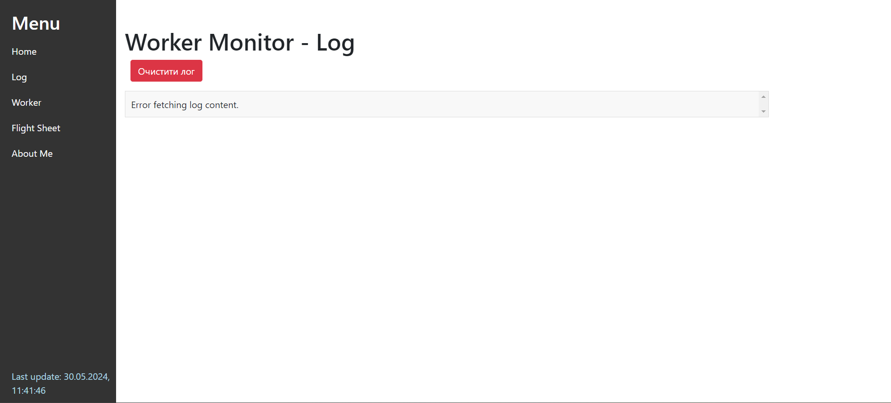

# Iceriver Monitor Tool

At the moment, everything is configured only under KSpro
I don't have other icerivers to test

This repository contains the Iceriver Monitor Tool executable, images, and instructions.

## Download

You can download the latest version of the tool from the [releases](https://github.com/your-username/Iceriver_Monitor_Tool/releases) page.

## Installation

1. Download the `Iceriver_Monitor_Tool.exe` from the [dist](dist/) folder.
2. Run the executable to start the application.

## Screenshots

## License

This project is licensed under the terms of the MIT license.

Donation Links
If you want to support me, here are the donation links:

PayPal: xordman@gmail.com

KAS: kaspa:qpxk4jrk4jfec3lc3wfcat8pt7kh2vsetm7p9euf3u6zfadyq72uja2767j6z

USDT (TRC20): TL9EDTRswXiFr1P8MzjErCBi1LbJzukszu
