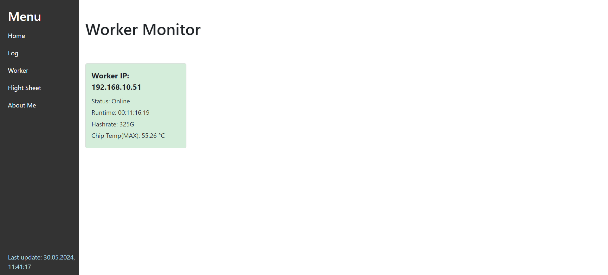

# Iceriver Monitor Tool

At the moment, everything is configured only under KSpro
I don't have other icerivers to test

After adding the first worker, you need to restart the program so that it starts making requests, then all other workers should be added normally, if requests for workers do not come, you need to add them all, restart the program and everything will work. I will fix this in future versions

This repository contains the Iceriver Monitor Tool executable, images, and instructions.

## Download

You can download the latest version of the tool from the [releases](https://github.com/xordman/Iceriver_Monitor_Tool/releases) page.

## Installation

1. Download the `Iceriver_Monitor_Tool.exe` from the [dist](dist/) folder.
2. Run the executable to start the application.

## Screenshots

## License

This project is licensed under the terms of the MIT license.

Donation Links
If you want to support me, here are the donation links:

PayPal: xordman@gmail.com

KAS: kaspa:qpxk4jrk4jfec3lc3wfcat8pt7kh2vsetm7p9euf3u6zfadyq72uja2767j6z

USDT (TRC20): TL9EDTRswXiFr1P8MzjErCBi1LbJzukszu
